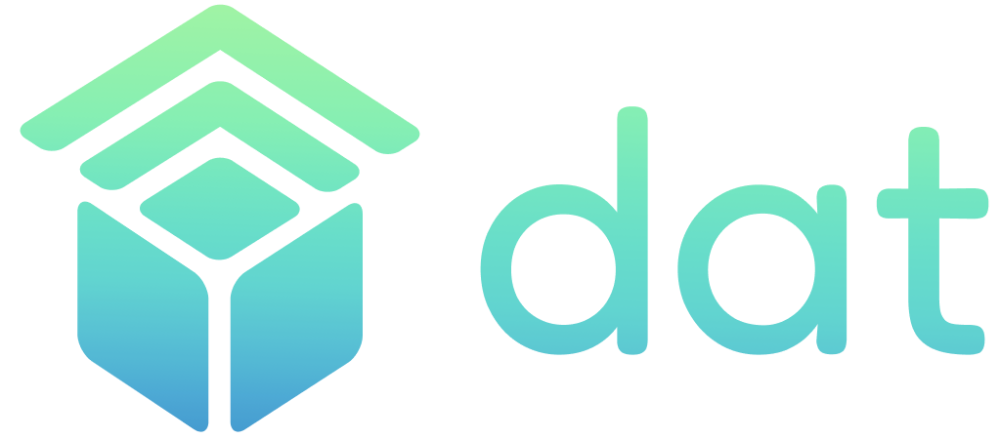

<!-- Improved compatibility of back to top link: See: https://github.com/othneildrew/Best-README-Template/pull/73 -->
<a name="readme-top"></a>
<!--
*** Thanks for checking out the Best-README-Template. If you have a suggestion
*** that would make this better, please fork the repo and create a pull request
*** or simply open an issue with the tag "enhancement".
*** Don't forget to give the project a star!
*** Thanks again! Now go create something AMAZING! :D
-->


<!-- PROJECT SHIELDS -->
<!--
*** I'm using markdown "reference style" links for readability.
*** Reference links are enclosed in brackets [ ] instead of parentheses ( ).
*** See the bottom of this document for the declaration of the reference variables
*** for contributors-url, forks-url, etc. This is an optional, concise syntax you may use.
*** https://www.markdownguide.org/basic-syntax/#reference-style-links
-->
[![Contributors][contributors-shield]][contributors-url]
[![Forks][forks-shield]][forks-url]
[![Stargazers][stars-shield]][stars-url]
[![Issues][issues-shield]][issues-url]
[![MIT License][license-shield]][license-url]


<!-- PROJECT LOGO -->
<br />
<div align="center">
  <a href="https://github.com/Niceural/dat">
    
  </a>

<h3 align="center">Digital Assets Tag</h3>

  <p align="center">
    Digitizing receipts using NFT and RFID tag
    <br />
    <a href="https://github.com/Niceural/dat"><strong>Explore the docs »</strong></a>
    <br />
    <br />
    <a href="https://github.com/Niceural/dat">View Demo</a>
    ·
    <a href="https://github.com/Niceural/dat/issues">Report Bug</a>
    ·
    <a href="https://github.com/Niceural/dat/issues">Request Feature</a>
  </p>
</div>


<!-- TABLE OF CONTENTS -->
<details>
  <summary>Table of Contents</summary>
  <ol>
    <li>
      <a href="#about-the-project">About The Project</a>
      <ul>
        <li><a href="#built-with">Built With</a></li>
      </ul>
    </li>
    <li>
      <a href="#getting-started">Getting Started</a>
      <ul>
        <li><a href="#prerequisites">Prerequisites</a></li>
        <li><a href="#installation">Installation</a></li>
      </ul>
    </li>
    <li><a href="#usage">Usage</a></li>
    <li><a href="#roadmap">Roadmap</a></li>
    <li><a href="#contributing">Contributing</a></li>
    <li><a href="#license">License</a></li>
    <li><a href="#contact">Contact</a></li>
    <li><a href="#acknowledgments">Acknowledgments</a></li>
  </ol>
</details>


<!-- ABOUT THE PROJECT -->
## About The Project

### Context

Consumers currently receive a physical receipt when they purchase goods like apparel. These are not environmentally sustainable and can be challenging to manage. 

Most receipts are composed of both paper and plastic. The materials are not recyclable because it is impossible to separate them.

To make matters worse, receipts can be forged easily through free websites. Digital receipts are even easier to forge.

### DAT

DAT (Digital Assets Tag) helps consumers who want to reduce environmental waste and fraud by providing a NFT receipt that replaces paper-based receipts completely and enables receipts to be more unique unlike current physical and digital receipts.

[![Product Name Screen Shot][product-screenshot]](https://example.com)

<p align="right">(<a href="#readme-top">back to top</a>)</p>


### Built With

* [![Next][Next.js]][Next-url]
* [![React][React.js]][React-url]

<p align="right">(<a href="#readme-top">back to top</a>)</p>


<!-- GETTING STARTED -->
## Getting Started

DAT architecture includes 2 main components - a frontend App and an Arduino-based RFID reader

### Prerequisites

- Install [Node.js](https://nodejs.org/en/) and [Yarn](https://yarnpkg.com/)
- Prepare [Arduino IDE](https://www.arduino.cc/en/software/)

### Frontend App Installation

1. Clone the repo
   ```sh
   git clone https://github.com/Niceural/dat.git
   ```
2. Navigate to `frontend/`
   ```sh
   cd ./frontend
   ```
3. Install frontend dependencies
   ```sh
   yarn
   ```
   or
   ```sh
   yarn install
   ```
4. Setup environment variable by creating `.env.local`

   Copy example file
   ```sh
   cp ./.env.example ./.env.local
   ```
   Update environment variables in `.env.local`
   ```sh
   NEXT_PUBLIC_CONTRACT_ADDRESS=<YOUR_CONTRACT_ADDRESS>
   # ...
   ```
5. Run Next.js dev server
   ```sh
   yarn dev
   ```

<p align="right">(<a href="#readme-top">back to top</a>)</p>


<!-- USAGE EXAMPLES -->
## Usage

Use this space to show useful examples of how a project can be used. Additional screenshots, code examples and demos work well in this space. You may also link to more resources.

_For more examples, please refer to the [Documentation](https://example.com)_

<p align="right">(<a href="#readme-top">back to top</a>)</p>


<!-- ROADMAP -->
## Roadmap

- [ ] Feature 1
- [ ] Feature 2
- [ ] Feature 3
    - [ ] Nested Feature

See the [open issues](https://github.com/Niceural/dat/issues) for a full list of proposed features (and known issues).

<p align="right">(<a href="#readme-top">back to top</a>)</p>


<!-- CONTRIBUTING -->
## Contributing

Contributions are what make the open source community such an amazing place to learn, inspire, and create. Any contributions you make are **greatly appreciated**.

If you have a suggestion that would make this better, please fork the repo and create a pull request. You can also simply open an issue with the tag "enhancement".
Don't forget to give the project a star! Thanks again!

1. Fork the Project
2. Create your Feature Branch (`git checkout -b feature/AmazingFeature`)
3. Commit your Changes (`git commit -m 'Add some AmazingFeature'`)
4. Push to the Branch (`git push origin feature/AmazingFeature`)
5. Open a Pull Request

<p align="right">(<a href="#readme-top">back to top</a>)</p>


<!-- LICENSE -->
## License

Distributed under the MIT License. See `LICENSE.txt` for more information.

<p align="right">(<a href="#readme-top">back to top</a>)</p>


<!-- CONTACT -->
## Contact

Your Name - [@twitter_handle](https://twitter.com/twitter_handle) - email@email_client.com

Project Link: [https://github.com/Niceural/dat](https://github.com/Niceural/dat)

<p align="right">(<a href="#readme-top">back to top</a>)</p>


<!-- ACKNOWLEDGMENTS -->
## Acknowledgments

* []()
* []()
* []()

<p align="right">(<a href="#readme-top">back to top</a>)</p>


<!-- MARKDOWN LINKS & IMAGES -->
<!-- https://www.markdownguide.org/basic-syntax/#reference-style-links -->
[contributors-shield]: https://img.shields.io/github/contributors/Niceural/dat.svg?style=for-the-badge
[contributors-url]: https://github.com/Niceural/dat/graphs/contributors
[forks-shield]: https://img.shields.io/github/forks/Niceural/dat.svg?style=for-the-badge
[forks-url]: https://github.com/Niceural/dat/network/members
[stars-shield]: https://img.shields.io/github/stars/Niceural/dat.svg?style=for-the-badge
[stars-url]: https://github.com/Niceural/dat/stargazers
[issues-shield]: https://img.shields.io/github/issues/Niceural/dat.svg?style=for-the-badge
[issues-url]: https://github.com/Niceural/dat/issues
[license-shield]: https://img.shields.io/github/license/Niceural/dat.svg?style=for-the-badge
[license-url]: https://github.com/Niceural/dat/blob/master/LICENSE.txt
[linkedin-shield]: https://img.shields.io/badge/-LinkedIn-black.svg?style=for-the-badge&logo=linkedin&colorB=555
[linkedin-url]: https://linkedin.com/in/linkedin_username
[product-screenshot]: images/screenshot.png
[Next.js]: https://img.shields.io/badge/next.js-000000?style=for-the-badge&logo=nextdotjs&logoColor=white
[Next-url]: https://nextjs.org/
[React.js]: https://img.shields.io/badge/React-20232A?style=for-the-badge&logo=react&logoColor=61DAFB
[React-url]: https://reactjs.org/